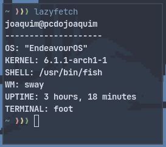

# LAZYFETCH

- Shut the fuck up - My friend
- NOOOOOOO where are the logos!!! - People on r/unixporn

A simple fetch for those who are lazy.



# Usage

Step 1 - Download this
Step 2 - Run `lazyfetch`
Step 3 - Profit

# Extending Lazyfetch

You can use a config file to extend Lazyfetch, using shell commands.
You need to create a `config.toml` file at `/home/yourname/.config/lazyfetch/config.toml`.
Then, define a path, and write modules for it. (Don't forget to add them to the array under `config.toml`!)

For an example, check `example_config.toml` and `example_module.toml` under `assets` folder.

# Installation

```bash
$ git clone https://gitlab.com/Jocadbz/lazyfetch.git
$ cd lazyfetch
$ v install betelgeuse_7.ansicolors
$ v -prod . # You need V compiler
```

*Made in V, btw*